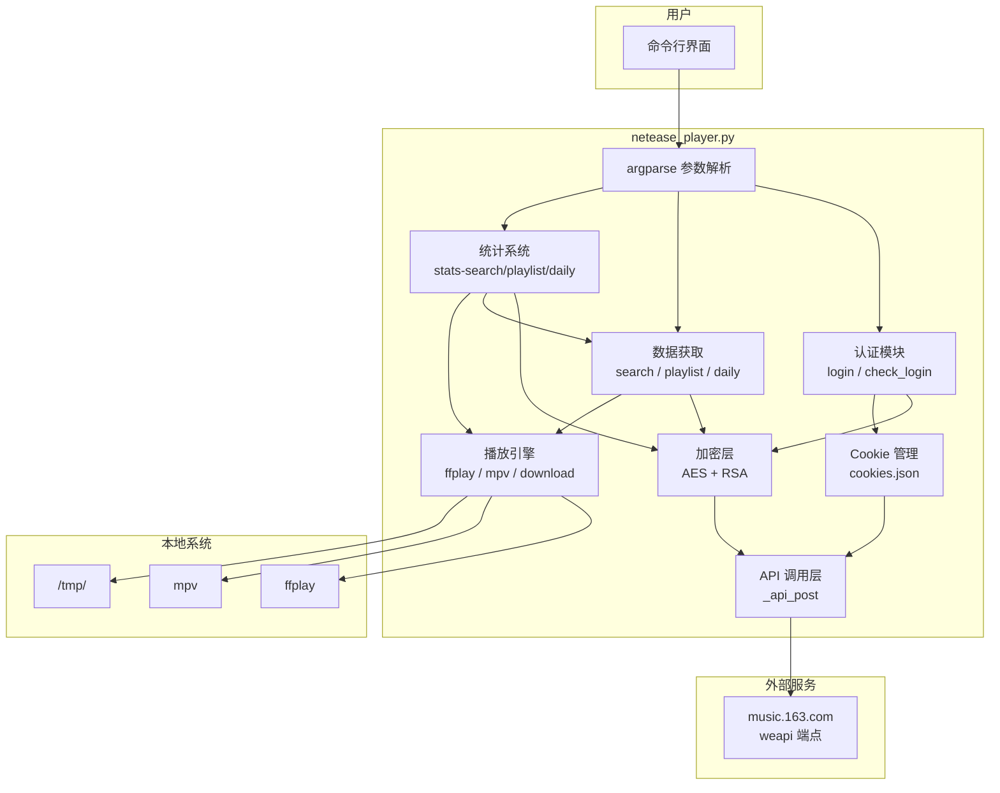
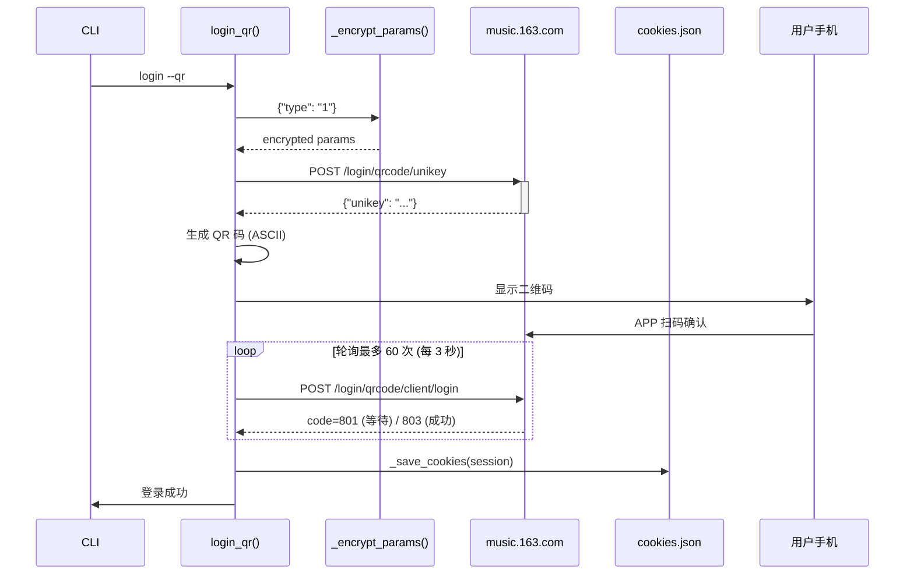
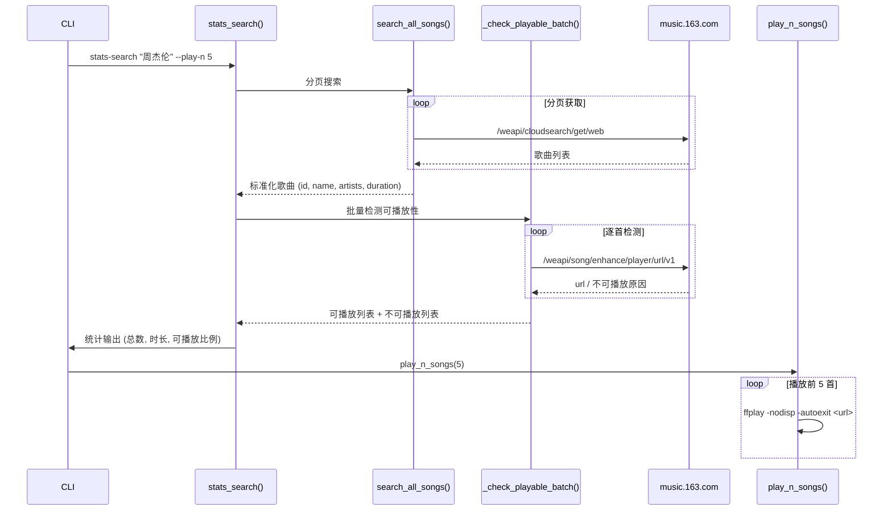

# 网易云音乐命令行播放器 - 系统架构

## 概述

netease_player 是一个运行在 Linux 服务器上的网易云音乐命令行播放器。它通过逆向工程实现了网易云音乐的 weapi 加密协议，支持多种登录方式（手机号/邮箱/二维码），提供歌曲搜索、在线播放、歌单浏览、每日推荐和歌手统计等功能。系统使用 `ffplay` 或 `mpv` 作为音频播放后端，支持按首数或时长批量连续播放。

## 技术栈

**语言与运行时**
- Python 3

**依赖库**
- `requests` — HTTP 客户端，用于所有 API 调用
- `pycryptodomex` (Cryptodome) — AES-CBC 加密，用于 weapi 请求体加密
- `qrcode` — QR 码生成（可选，用于二维码登录）

**播放器**
- `ffplay` (ffmpeg) — 默认音频后端，通过 `-nodisp -autoexit` 无头播放
- `mpv` — 备选音频后端，通过 `--no-video` 纯音频模式
- 下载回退 — 当无可用播放器时，通过 HTTP 下载 MP3 到 `/tmp/`

**外部服务**
- 网易云音乐 Web API (`music.163.com/weapi/`) — 所有数据交互的 API 端点

## 项目结构

```
workspace/
├── netease_player.py      # 主程序 (864 行，单文件架构)
├── qr_login.py            # 独立二维码登录辅助脚本
├── requirements.txt       # Python 依赖声明
├── .gitignore             # Git 忽略规则
└── ~/.netease_player/
    └── cookies.json       # 登录凭证持久化存储
```

**入口点**: `netease_player.py` 的 `main()` 函数，通过 argparse 子命令路由。

## 子系统

### 加密层
**目的**: 实现网易云音乐 weapi 的请求加密，使未经授权的 API 调用能够被服务端接受。

**位置**: `netease_player.py:24-67`

**关键文件**: `_aes_encrypt()`, `_rsa_encrypt()`, `_encrypt_params()`

**算法**:
- AES-128-CBC 双重加密（固定密钥 `NONCE` + 随机密钥 `secret`）
- RSA 加密随机密钥（固定 modulus 和 public exponent）
- `_encrypt_params(data)` → `{"params": "<base64>", "encSecKey": "<hex>"}`

**常量**: `MODULUS` (RSA 模数), `PUBKEY` ("010001"), `NONCE` (AES 初始密钥)

### 认证系统
**目的**: 支持四种登录方式，将会话 cookie 持久化到 JSON 文件。

**位置**: `netease_player.py:115-223`

**登录方式**:

| 方式 | 函数 | API | 特殊处理 |
|------|------|-----|---------|
| 手机号+密码 | `login_cellphone()` | `/login/cellphone` | MD5 密码 |
| 短信验证码 | `login_cellphone(sms=True)` | `/sms/captcha/sent` → `/login/cellphone` | 两步交互 |
| 邮箱+密码 | `login_email()` | `/login` | MD5 密码 |
| 二维码 | `login_qr()` | `/login/qrcode/unikey` → 轮询 `/login/qrcode/client/login` | ASCII QR 显示 |

**关键设计**: 所有登录函数创建独立的 `requests.Session()` 并通过 `session` 参数传入 `_api_post()`，确保 `Set-Cookie` 响应头被 session 自动收集。登录成功后调用 `_save_cookies(session)` 将 cookie dict 写入 `cookies.json`。

**状态检查**: `check_login()` 通过 `/w/nuser/account/get` 验证 cookie 有效性。

### Cookie 管理
**目的**: 持久化和管理登录态。

**位置**: `netease_player.py:88-111`

**存储格式**: JSON（`~/.netease_player/cookies.json`）

**关键函数**:
- `_save_cookies(session)` — 先写入 `.tmp` 再重命名，避免写入中断导致损坏
- `_load_cookies()` — 读回 dict
- `_get_cookies_dict()` — 读一次并转为 dict，供后续 API 调用使用

### 搜索与数据获取
**目的**: 通过网易云 API 获取歌曲信息、歌单、每日推荐。

**位置**: `netease_player.py:227-399`

**关键函数**:

| 函数 | API | 返回 |
|------|-----|------|
| `search_songs()` | `/weapi/cloudsearch/get/web` | 标准化歌曲列表 |
| `search_all_songs()` | 同上（分页） | 去重后最多 N 首歌曲 |
| `get_song_url()` | `/weapi/song/enhance/player/url/v1` | 可播放的音频 URL |
| `check_playable()` | 同上 | `(可播放, URL, 码率)` 三元组 |
| `get_lyrics()` | `/weapi/song/lyric` | LRC 歌词文本 |
| `get_user_playlists()` | `/weapi/user/playlist` | 用户歌单列表 |
| `get_playlist_tracks()` | `/api/v3/playlist/detail` | 歌单内歌曲列表 |
| `daily_recommend()` | `/weapi/v2/discovery/recommend/songs` | 每日推荐列表 |
| `get_uid()` | `/weapi/w/nuser/account/get` | 当前用户 UID |

**标准化**: `_song_to_dict()` 将 API 返回的歌曲数据标准化为 `{id, name, artists, album, duration}` 格式。

### 播放引擎
**目的**: 在无 GUI 环境下播放音频。

**位置**: `netease_player.py:442-541`

**播放器选择**: `_find_player()` 依次尝试 `mpv` → `ffplay` → 下载

**播放参数**:
- mpv: `--no-video`（纯音频）
- ffplay: `-nodisp -autoexit -loglevel error`（无窗口、播完退出、静默）

**批量播放**:
- `play_n_songs(songs, n)` — 顺序播放前 N 首可播放歌曲
- `play_n_minutes(songs, minutes)` — 顺序播放直到累计时长达到指定分钟数

**下载回退**: `_download_audio(url, title)` — HTTP 流式下载到 `/tmp/`，用歌曲名做文件名，冲突时追加毫秒时间戳。

### 统计系统
**目的**: 分析歌手歌曲的可播放状态、数量和时长。

**位置**: `netease_player.py:544-659`

**三种统计模式**:

| 命令 | 函数 | 数据源 |
|------|------|--------|
| `stats-search` | `stats_search()` | 按关键词搜索 |
| `stats-playlist` | `stats_playlist()` | 指定歌单（可选按歌手过滤） |
| `stats-daily` | `stats_daily()` | 每日推荐（可选按歌手过滤） |

**统计输出**: 总匹配数、可播放数、不可播放数，以及各自的总时长。不可播放歌曲标注原因（无版权/需VIP/已下架）。

**辅助函数**:
- `_filter_by_artist(songs, keyword)` — 按歌手/歌曲名模糊过滤
- `_check_playable_batch(songs, cookies)` — 批量并发检测可播放性
- `_print_stats(songs, playable, unplayable, label)` — 格式化输出统计结果

### CLI 路由层
**目的**: 参数解析和命令分发。

**位置**: `netease_player.py:664-864`

**命令注册**: 使用 `argparse` 的 `add_subparsers()` 注册以下子命令:
- `login` — 登录（-p 手机号/邮箱, -P 密码, --sms, --qr）
- `status` — 查看登录状态
- `search` — 搜索歌曲并交互式选择播放
- `play` — 按 ID 直接播放
- `playlist` — 浏览歌单并播放
- `daily` — 每日推荐浏览播放
- `stats-search` — 搜索统计（--play-n, --play-min）
- `stats-playlist` — 歌单统计（-a 歌手过滤, --play-n, --play-min）
- `stats-daily` — 每日推荐统计（-a 歌手过滤, --play-n, --play-min）

## 架构图

### 系统架构



### 登录流程时序图



### 统计与播放流程


